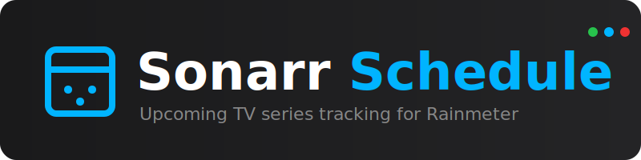
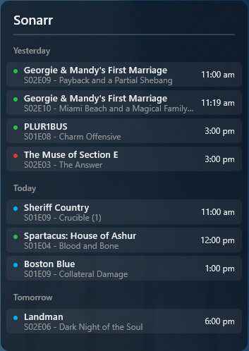

<div align="center">



[](https://github.com/csmit195/rm-sonarr-schedule-skin/releases)
[](https://github.com/csmit195/rm-sonarr-schedule-skin/releases)
[](https://www.rainmeter.net/)

**A sleek, minimal schedule for your Sonarr episodes directly on your desktop.**

</div>

## Overview
**Sonarr Schedule** is a lightweight Rainmeter skin that connects to your Sonarr server to display upcoming TV show episodes. It provides a quick glance at what’s airing today, tomorrow, and in the coming days, with status indicators to help you track your library.

## Preview


## Features
- **Dynamic Schedule**: Automatically groups episodes by day (Yesterday, Today, Tomorrow, etc.).
- **Status Indicators**: Color-coded dots show the state of each episode (Downloaded, Missing, or Unaired).
- **Tooltips**: Hover over any episode to see its synopsis and full details.
- **Customizable**: Easily adjust the skin width, number of days shown, and color scheme.
- **Auto-Updating**: Periodically refreshes data from your Sonarr instance.

## Installation
1. Download the latest `.rmskin` package from the [Releases Page](https://github.com/csmit195/rm-sonarr-schedule-skin/releases/latest).
2. Double-click the file to install it with Rainmeter.
3. Load the skin: `Skins` -> `Sonarr` -> `Sonarr.ini`.

## Configuration
To set up the skin, you need to edit the variables file:

1.  Right-click the skin and select **Open folder**.
2.  Navigate to the `@Resources` folder.
3.  Open `variables.inc` with a text editor (like Notepad).

### 1. Connection (Required)
You must set your Sonarr address and API key for the skin to work.

```ini
SonarrURL=http://localhost:8989
; Your Sonarr IP and Port (Include http://)

SonarrAPIKey=YOUR_API_KEY_HERE
; Found in Sonarr Settings -> General -> Security -> API Key
```

### 2. Display Settings
Fine-tune how much information is shown on your desktop.

```ini
MaxDaysToShow=5
; The number of upcoming days to display on the skin. With default settings, you can do up to 14 days (should be more than enough.)

ShowYesterday=1
; Set to 1 to show episodes from the previous day, or 0 to hide them.

RefreshRate=15
; How often (in minutes) the skin should fetch new data from Sonarr.
```

### 3. Visual Customization
Adjust the width and colors to match your desktop theme.

```ini
Width=350
; The width of the skin in pixels.

BgColor=15,18,25,240
; Background color in R,G,B,Alpha format.

FontMain=Segoe UI
; Primary font used for the interface.
```

## Status Guide
Each episode is marked with a colored dot representing its status in your Sonarr library:

- 🟢 **Green**: Episode is downloaded and present in your library.
- 🔵 **Blue**: Episode has not aired yet (Upcoming).
- 🔴 **Red**: Episode has aired but is missing from your library.

## Troubleshooting
*   **"API Error" / No Data**: Ensure your `SonarrURL` is correct (including `http://`) and your `SonarrAPIKey` is valid.
*   **Connection Refused**: If Sonarr is on another machine, ensure its firewall allows connections on port 8989.
*   **Skin not updating**: After changing variables, you must right-click the skin and select **Refresh skin**.

## Credits
*   **Skin & Code**: csmit195
*   **Backend Data**: Powered by Sonarr API

<div align="center">
Licensed under Creative Commons Attribution-Non-Commercial-Share Alike 3.0
</div>